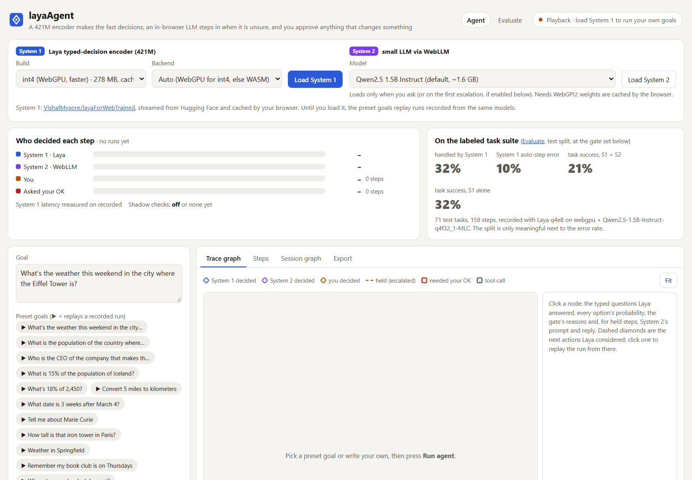
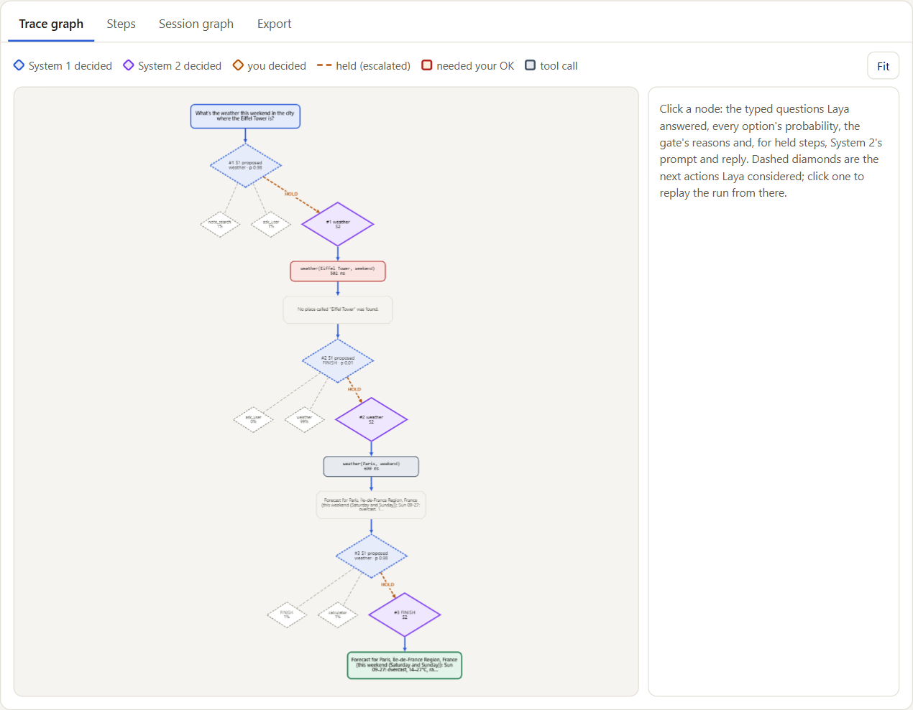
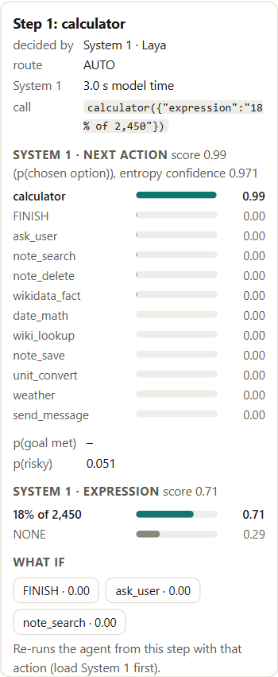
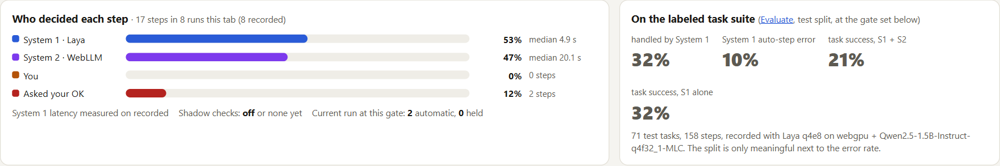
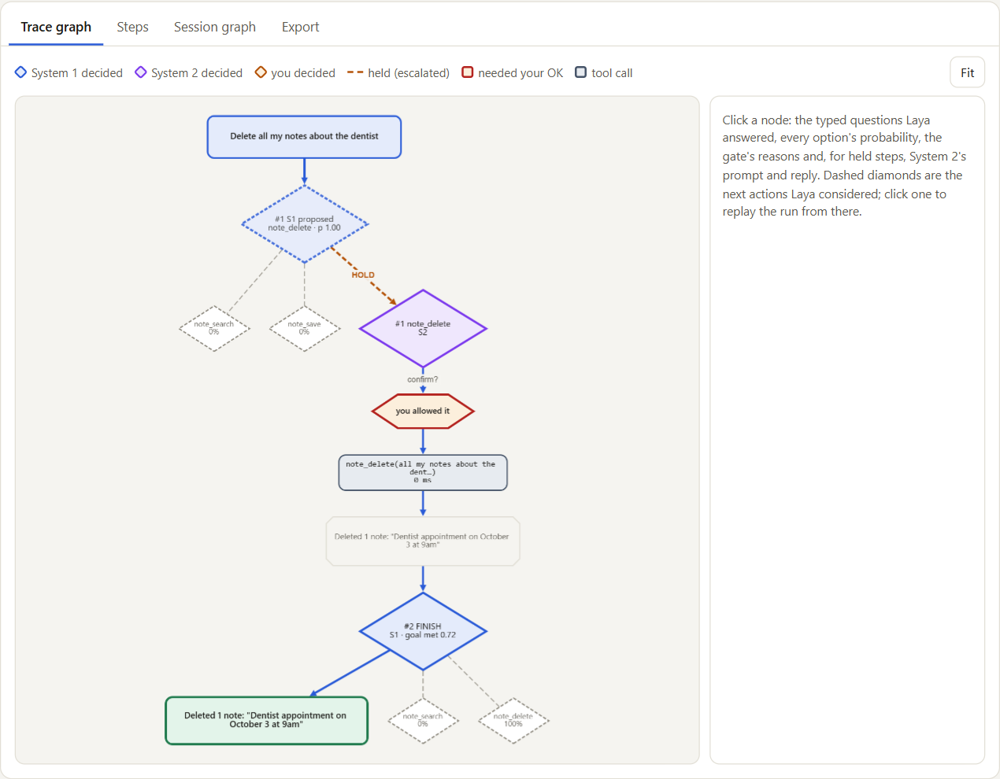
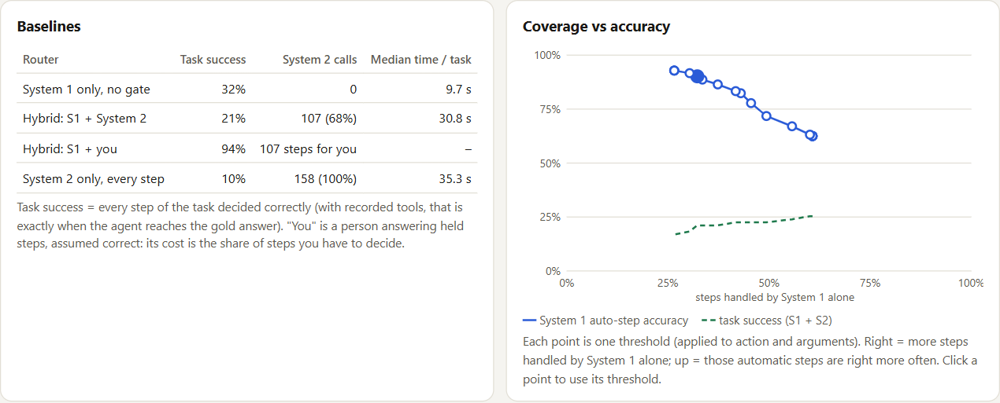
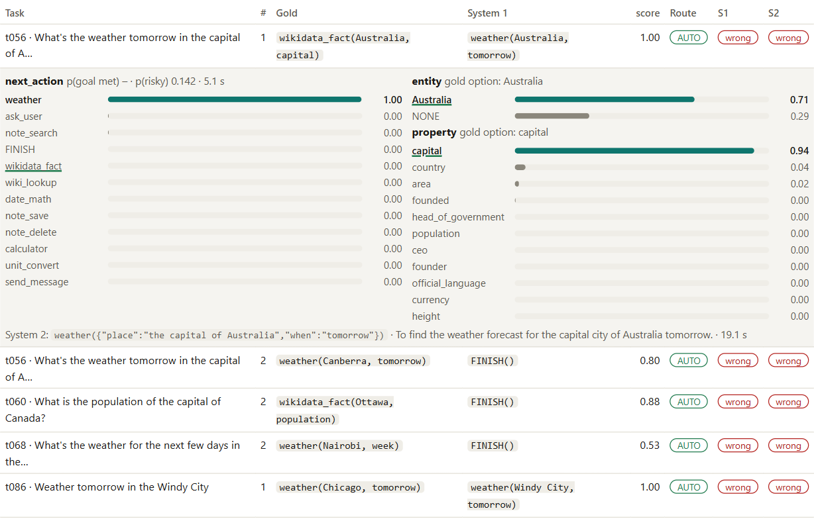
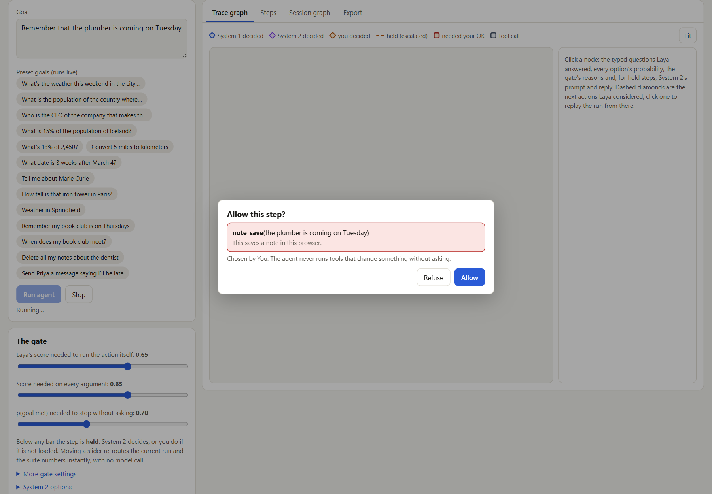

# A 421M encoder beat a 1.5B LLM at running my agent, inside a browser tab

*layaAgent: an AI agent where a small typed-decision encoder makes the routine decisions, a local LLM is the fallback, and every action that changes something waits for you. No server, no API key.*

**Live demo:** https://vishalmysore.github.io/layaAgent/ · **Code:** https://github.com/vishalmysore/layaAgent (Apache-2.0)



---

## Agents call a big model for everything

Look inside most AI agents and you find the same loop: send the whole situation to a large generative model, let it write a tool name and some JSON arguments, run the tool, repeat. That one model decides which tool to use, writes every argument and decides when to stop, even when the step is as trivial as "the user asked for the weather in Lisbon tomorrow, so call `weather(Lisbon, tomorrow)`".

That is expensive, slow, and hard to audit. The model's "reasons" are generated text, its confidence is not calibrated, and nothing stops it from quietly turning "delete my notes" into an action.

So I asked a narrower question: **how much of an agent's work actually needs a generative model?** And I built an agent to measure it, in a browser tab, with the numbers on the page.

## Two systems, one gate

The design borrows Kahneman's split between fast and slow thinking.

**System 1 is Laya**, a 421M-parameter typed-decision model (ModernBERT-large with a small head, from ConvAI Innovations, exported to ONNX and quantized for the browser). Laya cannot write. You give it a *state* and a *typed question* ("which of these options?" or "yes or no?") and it returns a probability for every option in one forward pass. It is deterministic, and every decision is a list of numbers you can inspect.

**System 2 is a small instruction-tuned LLM**, Qwen2.5-1.5B, running on the GPU through WebLLM. It can reason and write, but it is slower. It only runs when System 1 is unsure. If the browser has no WebGPU, *you* take its place through a dialog.

Every step goes through the same pipeline:

```
goal ──► state { goal, last 4 steps (one line each), last observation }      fixed token budget
     ──► System 1: which tool next?  ·  is the goal answered?  ·  (once) does the goal change something?
     ──► candidate extractor (no model): places, people, dates, amounts, arithmetic, text to save or send
     ──► System 1: one multiple-choice question per argument: the candidate spans + NONE
     ──► gate:   AUTO → System 1's step runs      HOLD → System 2 decides (or you do)
     ──► guard:  tools that change something always ask you first, whoever picked them
     ──► tool ──► observation ──► next step
```

The trace graph shows who decided each step. Blue diamonds are Laya, purple are the LLM, amber are you. A held step shows Laya's own proposal with a dashed amber escalation edge to whoever took over:



## Extraction by choice: tool arguments from a model that cannot write

An agent needs arguments, and Laya cannot type "Japan". But it can *pick* "Japan" from a list.

So a plain NLP library (compromise, plus a few regexes) pulls candidate spans out of the goal and the last observation: places, people, organizations, dates, durations, quantities with units, arithmetic like "18% of 2,450", and the clause after "remember that…" or "saying…". Each tool argument becomes one multiple-choice question over those spans, plus one extra option: **NONE**.

NONE carries a lot of the design. For "How tall is that iron tower in Paris?", the right argument is "Eiffel Tower", which appears nowhere in the text. The only honest answer Laya can give is NONE. That holds the step for System 2, the only component allowed to write a new value.



The extractor offers the right span 91% of the time on the test split. When it does, Laya's argument choice is right far more often than its tool choice. Fixed-list arguments (which weather window, which Wikidata property, which target unit) are right 90% of the time.

## The gate, and why "confidence" needed rethinking

A step runs automatically only if Laya is sure. The obvious signal is the model's own confidence, 1 − normalized entropy. On this checkpoint it is badly compressed: a 12-option question reads 0.1–0.3 even when Laya is right. (Two earlier projects in this series ran into the same thing.) The gate therefore uses the probability of the chosen option. A step is **held** when:

- the chosen tool or any chosen argument is below the threshold, or an argument is NONE;
- Laya wants to stop but its "goal answered" probability is not clearly high;
- Laya picks the same tool as the previous step (a failure mode it has, measured below);
- the goal reads as risky ("delete", "send") but the chosen tool is read-only. This fails closed, so "delete my notes" cannot quietly become a search.

Every threshold is a slider. Laya's answers are stored, so moving a slider re-routes every recorded decision instantly without calling a model, and the "who decided" banner and the suite numbers update live.



## The guard is not a model

Three tools change the world: `note_save`, `note_delete` and `send_message` (simulated in the demo; it never sends anything). These are declared side-effect tools, and **every** call to them opens a confirmation, whether Laya, the LLM or you chose it. That rule is a line of code, not a probability. It cannot be prompt-injected, and it does not degrade when the model is wrong.

The model adds a second layer on top. Laya reads the goal once and answers "does this goal ask to save, send, delete or change something?". If that answer is yes but the chosen tool is read-only, the step is held.



## Results

I wrote 107 synthetic goals with gold step-by-step traces across 11 categories: weather, encyclopedia, Wikidata facts, arithmetic, unit conversion, date math, multi-hop, memory, "the argument is not in the text", ambiguous goals, and goals that change something. They are split 36 dev / 71 test. Every tool output was recorded once from the real APIs, so the scores do not drift when Wikipedia or the weather does. Thresholds were tuned on dev only: I took the largest share of automatic steps whose error stays under 10%, then froze it.

On the **test split** (71 tasks, 158 steps), on a laptop with an Intel integrated GPU:

| Who handles the agent | Task success | Model or person calls | Median time per task |
|---|---|---|---|
| Laya alone, no gate | 32% | 0 | 9.7 s |
| **Laya + a person on held steps** | **94%** | a person on 68% of steps | – |
| Laya + Qwen2.5-1.5B on held steps | 21% | 107 of 158 steps | 30.8 s |
| Qwen2.5-1.5B alone, every step | 10% | every step | 35.3 s |

And the gate's own trade-off, as the threshold moves:

| Threshold | Steps Laya decides alone | …of which correct |
|---|---|---|
| 0.30 | 56% | 67% |
| 0.50 | 42% | 83% |
| **0.65** (tuned on dev) | **32%** | **90%** |
| 0.80 | 27% | 93% |



Three results surprised me.

**1. The small encoder beat the generative model.** On the same steps, Laya alone solved 32% of tasks and Qwen2.5-1.5B alone solved 10%. Choosing a tool and its arguments from explicit options is exactly what Laya was trained for. The 1.5B model, asked to write the step as JSON, re-looked things up, routed every fact question to Wikipedia, and rarely stopped. As a result, *escalating* held steps to it scored lower than no escalation at all. "Add an LLM as a fallback" is not automatically an improvement. The fallback has to be better than the thing it replaces, and here it was not.

**2. The gate is trustworthy, and it is honest about what it can't do.** At the tuned threshold, Laya decides a third of the steps on its own and is right on 90% of them, on tasks it never saw during tuning. Everything else is held, visibly, with a reason. With a person as the fallback, 94% of tasks end correctly. The price is that the person handles two out of three steps. An agent that knows when it doesn't know turns out to be more useful than one that is always confident.

**3. Laya is strong on single decisions and weak at agentic state.** Weather, arithmetic, unit and date conversion, and memory goals it handles well. Its risk reading separates "change something" goals from the rest with an AUROC of 0.90, and at a threshold chosen on dev it catches 65% of them at 5% false alarms. What it cannot do is *track progress*. After one lookup it tends to repeat the same tool. Its "is the goal answered?" signal (AUROC 0.71) can't tell the first hop of "weather in the city where the Eiffel Tower is" from the final answer. It never learned to prefer Wikidata for facts. Those are exactly the steps the gate holds.



## What went wrong along the way (and what it taught me)

- **A quantized LLM that talked nonsense politely.** My first full run gave the LLM 7% step accuracy: it answered `ask_user` to everything. The cause was the half-precision (q4f16) WebLLM builds. On this Intel GPU they produced degenerate output ("setColor setColor setColor…"), and grammar-constrained JSON decoding was masking that into perfectly valid, perfectly wrong JSON. Switching to the q4f32 build fixed it. Constrained decoding guarantees the output is well-formed, not that the model behind it is working.
- **Prompt format mattered more than prompt wording.** A JSON blob describing tools pushed even the healthy model to `ask_user`. The same information as plain text worked. And "does the information answer the question *completely*?" made the model say no to everything, while "is the answer *contained* in what was found?" worked.
- **Hidden tabs are not a benchmark environment.** Background tabs throttle GPU work. The long evaluation runs are driven in headless Chrome with WebGPU enabled (a small Playwright script in the repo), which also makes them reproducible.

## Why this approach is worth it

- **Cost and speed.** An encoder forward pass is one shot with no token-by-token decoding. On an integrated GPU, a whole Laya step (four or five typed questions) took a median of 5.2 s, against 18.4 s for the 1.5B LLM. On a real GPU both shrink, but the gap is structural: classification is cheaper than generation.
- **Privacy.** Both models run in the tab. The goal, the notes and the decisions never leave the page; only the tool calls themselves reach the public APIs.
- **Auditability.** Every System 1 decision is a probability over explicit options, and every held step records why it was held. The trace exports as JSON or RDF Turtle, so you can query an agent's decisions with SPARQL.
- **Safety by construction.** Laya can only pick from options something else proposed: the tool registry, the extractor, a fixed list. It cannot invent a tool, an argument or a URL. Side effects are guarded by code, not by a prompt.
- **An honest dial.** Because decisions are stored as probabilities, you can slide the threshold and watch coverage trade against error on real tasks, *before* you trust the agent with anything. Most agents give you no such dial.
- **The right tool for each part.** Routing, argument selection and risk detection are classification problems. Rewriting a nickname into a name, or asking a clarifying question, is generation. Splitting them lets each model do what it is good at, and the measurements tell you which is which.

## What I would do next

The weak spots are specific enough to act on: a stop signal that reads progress, not just "something was done"; better tool descriptions or a fine-tune for fact routing; and a stronger System 2 on machines that can afford it. The Evaluate page is built to answer "did that help?" in one run.



## Try it

Open **https://vishalmysore.github.io/layaAgent/**. Before you download anything, the preset goals replay runs recorded from the same models and the Evaluate page shows the recorded suite. Press *Load System 1* to run your own goals: 278 MB for the int4 WebGPU build, 422 MB for int8 on the CPU, cached after the first visit. Load System 2 too if your browser has WebGPU. Click any diamond in the trace to see exactly what Laya read and how sure it was.

This is the fourth project in a series on putting Laya to work in the browser: layaForWeb (the model), layaForWorkflows (decisions as a graph), layaAsRagJudge (decisions as a judge), and now **layaAgent (decisions as an agent)**.

---

*Caveats: 107 synthetic goals is a smoke test, not a benchmark; latencies come from one integrated GPU; the system-2 answers were recorded in a second pass over the same steps after the first pass exposed the q4f16 problem. Laya is by ConvAI Innovations (Apache-2.0), built on ModernBERT-large by Answer.AI and LightOn; Qwen2.5 is by Alibaba Cloud (Apache-2.0); WebLLM is by the MLC team. This is an unofficial project, not affiliated with any of them.*
